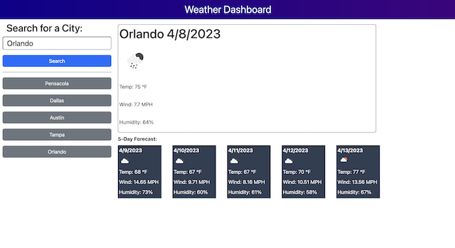
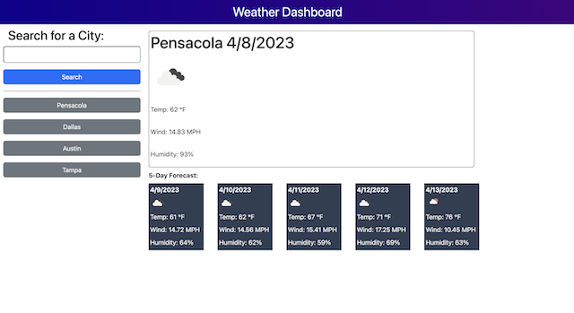
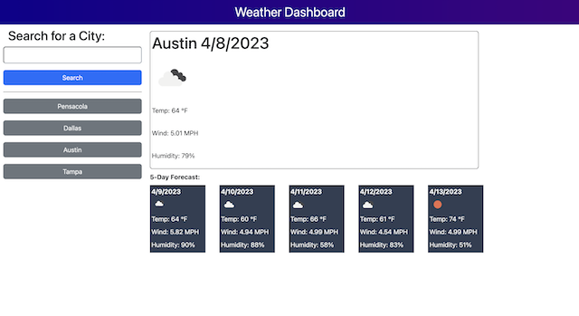

# weather-dashboard
An application to check the current weather and five day forecast.

---
## Directions

To use this tool, please enter a city that you would like to get the weather data for, into the search box on the left hand side. Once you have entered in a city and clicked "serach", the eather data for that city will be populated on the right hand side of the screen. You will see a large section which is the current day data. It will display the name of the city you searched, the current date, an icon to summarize the type of weather cast for the day, the temperature, wind speed, and humidity. below this section, you will see that there is also a forecast for the next five days for the city you searched for. In this area, you can see a card that contains the same informaiton from the current day section for the next five days. 

Once you have searched a city, your search will be stored into local storage and added to a list on the left hand side below the search bar so that you can easily click on a city that you have previously looked up. If you click on a stored search city, you will be provided with the updated weather data for that city. If you want to remove your searched cities, please empty your local storage and refresh the page.

---
## Resources:

### OpenWeatherMap API
- API: Call 5 day / 3 hour forecast data (http://api.openweathermap.org/data/2.5/forecast)

- API: Geocoding API (http://api.openweathermap.org/geo/1.0/direct)

---

## Screenshots:

---

---

---